# Casos de Uso - Sistema MidTalk

## Visão Geral

Este documento apresenta os casos de uso do Sistema MidTalk - Gestão de Chamados e Suporte Técnico com IA. Os casos de uso estão organizados por módulos e atores do sistema.

## Atores do Sistema

### Atores Primários
- **Administrador**: Usuário com acesso total ao sistema
- **Técnico**: Usuário responsável por atender chamados
- **Usuário Final**: Cliente que utiliza o FAQ e chat

### Atores Secundários
- **Sistema de IA**: Google Gemini API
- **Sistema de Email**: Para notificações
- **Banco de Dados**: SQL Server

---

## Diagrama de Casos de Uso

```mermaid
graph TB
    %% Atores
    Admin[👤 Administrador]
    Tecnico[👤 Técnico]
    Usuario[👤 Usuário Final]
    IA[🤖 Sistema IA]
    
    %% Casos de Uso - Gestão de Usuários
    subgraph "Gestão de Usuários"
        UC001[UC001 - Cadastrar Técnico]
        UC002[UC002 - Listar Técnicos]
        UC003[UC003 - Editar Técnico]
        UC004[UC004 - Desativar Técnico]
        UC005[UC005 - Visualizar Detalhes]
    end
    
    %% Casos de Uso - Autenticação
    subgraph "Autenticação"
        UC006[UC006 - Fazer Login]
        UC007[UC007 - Fazer Logout]
        UC008[UC008 - Validar Sessão]
    end
    
    %% Casos de Uso - Portal FAQ
    subgraph "Portal FAQ"
        UC009[UC009 - Consultar FAQ]
        UC010[UC010 - Buscar FAQ]
        UC011[UC011 - Filtrar por Categoria]
        UC012[UC012 - Iniciar Chat IA]
    end
    
    %% Casos de Uso - Chat com IA
    subgraph "Chat com IA"
        UC013[UC013 - Processar Pergunta]
        UC014[UC014 - Fornecer Resposta]
        UC015[UC015 - Escalar para Técnico]
        UC016[UC016 - Manter Contexto]
    end
    
    %% Casos de Uso - Gestão de Chamados
    subgraph "Gestão de Chamados"
        UC017[UC017 - Criar Chamado]
        UC018[UC018 - Listar Chamados]
        UC019[UC019 - Atender Chamado]
        UC020[UC020 - Atualizar Status]
        UC021[UC021 - Resolver Chamado]
        UC022[UC022 - Fechar Chamado]
    end
    
    %% Casos de Uso - Relatórios
    subgraph "Relatórios"
        UC023[UC023 - Gerar Dashboard]
        UC024[UC024 - Relatório Performance]
        UC025[UC025 - Métricas IA]
    end
    
    %% Relacionamentos Administrador
    Admin --> UC001
    Admin --> UC002
    Admin --> UC003
    Admin --> UC004
    Admin --> UC005
    Admin --> UC006
    Admin --> UC007
    Admin --> UC008
    Admin --> UC018
    Admin --> UC020
    Admin --> UC023
    Admin --> UC024
    Admin --> UC025
    
    %% Relacionamentos Técnico
    Tecnico --> UC006
    Tecnico --> UC007
    Tecnico --> UC008
    Tecnico --> UC018
    Tecnico --> UC019
    Tecnico --> UC020
    Tecnico --> UC021
    Tecnico --> UC022
    
    %% Relacionamentos Usuário Final
    Usuario --> UC009
    Usuario --> UC010
    Usuario --> UC011
    Usuario --> UC012
    Usuario --> UC017
    
    %% Relacionamentos Sistema IA
    IA --> UC013
    IA --> UC014
    IA --> UC015
    IA --> UC016
    
    %% Includes e Extends
    UC012 -.->|include| UC013
    UC013 -.->|include| UC014
    UC014 -.->|extend| UC015
    UC015 -.->|include| UC017
    UC019 -.->|include| UC020
    UC021 -.->|include| UC022
```

---

## UC001 - Cadastrar Técnico

**Ator Principal**: Administrador  
**Objetivo**: Cadastrar novo usuário técnico no sistema  
**Pré-condições**: Administrador autenticado no sistema  

### Fluxo Principal
1. Administrador acessa tela de cadastro de técnicos
2. Sistema exibe formulário de cadastro
3. Administrador preenche dados obrigatórios:
   - Nome completo
   - Email
   - Perfil de acesso (Administrador/Técnico)
4. Sistema valida dados informados
5. Sistema verifica unicidade do email
6. Sistema define senha padrão "123"
7. Sistema define status inicial como "Ativo"
8. Sistema registra data de cadastro
9. Sistema salva técnico no banco de dados
10. Sistema exibe mensagem de sucesso

### Fluxos Alternativos
**FA01 - Email já existe**
- 5a. Sistema detecta email duplicado
- 5b. Sistema exibe mensagem de erro
- 5c. Retorna ao passo 3

**FA02 - Dados inválidos**
- 4a. Sistema detecta dados inválidos
- 4b. Sistema exibe mensagens de validação
- 4c. Retorna ao passo 3

### Pós-condições
- Novo técnico cadastrado no sistema
- Email de boas-vindas enviado (futuro)
- Log de auditoria registrado

---

## UC002 - Listar Técnicos

**Ator Principal**: Administrador  
**Objetivo**: Visualizar lista de técnicos cadastrados  
**Pré-condições**: Administrador autenticado no sistema  

### Fluxo Principal
1. Administrador acessa tela de listagem de técnicos
2. Sistema busca todos os técnicos no banco
3. Sistema exibe lista com:
   - Nome
   - Email
   - Status (Ativo/Inativo)
   - Perfil de acesso
   - Data de cadastro
4. Sistema disponibiliza opções de:
   - Filtrar por status
   - Filtrar por perfil
   - Buscar por nome/email
   - Editar técnico
   - Desativar técnico

### Fluxos Alternativos
**FA01 - Aplicar filtros**
- 4a. Administrador seleciona filtros
- 4b. Sistema aplica filtros selecionados
- 4c. Sistema atualiza listagem

**FA02 - Buscar técnico**
- 4a. Administrador digita termo de busca
- 4b. Sistema filtra resultados em tempo real
- 4c. Sistema exibe resultados da busca

### Pós-condições
- Lista de técnicos exibida
- Filtros aplicados conforme seleção

---

## UC003 - Editar Técnico

**Ator Principal**: Administrador  
**Objetivo**: Alterar dados de técnico existente  
**Pré-condições**: 
- Administrador autenticado
- Técnico existe no sistema

### Fluxo Principal
1. Administrador seleciona técnico para edição
2. Sistema carrega dados atuais do técnico
3. Sistema exibe formulário preenchido
4. Administrador modifica dados desejados
5. Sistema valida alterações
6. Sistema verifica unicidade do email (se alterado)
7. Sistema registra data da modificação
8. Sistema salva alterações no banco
9. Sistema exibe mensagem de sucesso

### Fluxos Alternativos
**FA01 - Email duplicado**
- 6a. Sistema detecta email já utilizado
- 6b. Sistema exibe mensagem de erro
- 6c. Retorna ao passo 4

**FA02 - Cancelar edição**
- 4a. Administrador cancela operação
- 4b. Sistema descarta alterações
- 4c. Retorna à listagem

### Pós-condições
- Dados do técnico atualizados
- Data de modificação registrada
- Log de auditoria criado

---

## UC004 - Desativar Técnico

**Ator Principal**: Administrador  
**Objetivo**: Desativar técnico sem excluir dados  
**Pré-condições**: 
- Administrador autenticado
- Técnico ativo no sistema

### Fluxo Principal
1. Administrador seleciona técnico para desativação
2. Sistema exibe confirmação de desativação
3. Administrador confirma operação
4. Sistema verifica chamados ativos do técnico
5. Sistema reatribui chamados ativos (se houver)
6. Sistema altera status para "Inativo"
7. Sistema registra data da modificação
8. Sistema salva alteração no banco
9. Sistema exibe mensagem de sucesso

### Fluxos Alternativos
**FA01 - Cancelar desativação**
- 3a. Administrador cancela operação
- 3b. Sistema mantém técnico ativo
- 3c. Retorna à listagem

**FA02 - Reatribuir chamados**
- 5a. Sistema identifica chamados ativos
- 5b. Sistema seleciona outros técnicos disponíveis
- 5c. Sistema reatribui chamados automaticamente
- 5d. Sistema notifica técnicos envolvidos

### Pós-condições
- Técnico desativado no sistema
- Chamados reatribuídos
- Histórico preservado

---

## UC005 - Visualizar Detalhes do Técnico

**Ator Principal**: Administrador  
**Objetivo**: Visualizar informações detalhadas do técnico  
**Pré-condições**: 
- Administrador autenticado
- Técnico existe no sistema

### Fluxo Principal
1. Administrador seleciona técnico para visualização
2. Sistema busca dados completos do técnico
3. Sistema busca estatísticas de atendimento
4. Sistema busca chamados atribuídos
5. Sistema exibe tela de detalhes com:
   - Dados cadastrais completos
   - Estatísticas de performance
   - Chamados atualmente atribuídos
   - Histórico de modificações
   - Métricas de atendimento

### Fluxos Alternativos
**FA01 - Técnico sem estatísticas**
- 3a. Sistema não encontra dados de atendimento
- 3b. Sistema exibe mensagem informativa
- 3c. Continua exibição dos demais dados

### Pós-condições
- Detalhes do técnico exibidos
- Estatísticas calculadas e apresentadas

---

## UC006 - Fazer Login

**Ator Principal**: Administrador, Técnico  
**Objetivo**: Autenticar usuário no sistema  
**Pré-condições**: Usuário possui credenciais válidas  

### Fluxo Principal
1. Usuário acessa tela de login
2. Sistema exibe formulário de autenticação
3. Usuário informa email e senha
4. Sistema valida formato dos dados
5. Sistema verifica credenciais no banco
6. Sistema gera token JWT
7. Sistema registra log de acesso
8. Sistema redireciona conforme perfil:
   - Administrador: Dashboard administrativo
   - Técnico: Lista de chamados

### Fluxos Alternativos
**FA01 - Credenciais inválidas**
- 5a. Sistema não encontra usuário ou senha incorreta
- 5b. Sistema exibe mensagem de erro
- 5c. Sistema registra tentativa de acesso
- 5d. Retorna ao passo 3

**FA02 - Usuário inativo**
- 5a. Sistema identifica usuário desativado
- 5b. Sistema exibe mensagem informativa
- 5c. Sistema nega acesso
- 5d. Retorna ao passo 3

### Pós-condições
- Usuário autenticado no sistema
- Sessão ativa criada
- Log de acesso registrado

---

## UC007 - Fazer Logout

**Ator Principal**: Administrador, Técnico  
**Objetivo**: Encerrar sessão do usuário  
**Pré-condições**: Usuário autenticado no sistema  

### Fluxo Principal
1. Usuário solicita logout
2. Sistema invalida token JWT
3. Sistema limpa dados de sessão
4. Sistema registra log de logout
5. Sistema redireciona para tela de login

### Pós-condições
- Sessão encerrada
- Token invalidado
- Log de logout registrado

---

## UC008 - Validar Sessão

**Ator Principal**: Sistema  
**Objetivo**: Verificar validade da sessão do usuário  
**Pré-condições**: Usuário com token de sessão  

### Fluxo Principal
1. Sistema recebe requisição com token
2. Sistema valida assinatura do token
3. Sistema verifica expiração do token
4. Sistema confirma usuário ativo
5. Sistema permite acesso ao recurso

### Fluxos Alternativos
**FA01 - Token inválido ou expirado**
- 2a/3a. Sistema detecta token inválido
- 2b/3b. Sistema nega acesso
- 2c/3c. Sistema redireciona para login

**FA02 - Usuário inativo**
- 4a. Sistema identifica usuário desativado
- 4b. Sistema invalida sessão
- 4c. Sistema redireciona para login

### Pós-condições
- Acesso autorizado ou negado
- Sessão mantida ou invalidada

## UC009 - Consultar FAQ

**Ator Principal**: Usuário Final  
**Objetivo**: Consultar perguntas frequentes no portal público  
**Pré-condições**: Acesso à internet  

### Fluxo Principal
1. Usuário acessa portal FAQ público
2. Sistema carrega página inicial do FAQ
3. Sistema exibe lista de FAQs organizadas por categoria
4. Usuário navega pelas categorias disponíveis
5. Sistema exibe FAQs da categoria selecionada
6. Usuário seleciona FAQ de interesse
7. Sistema exibe pergunta e resposta completa
8. Sistema disponibiliza chat IA para dúvidas adicionais

### Fluxos Alternativos
**FA01 - FAQ não encontrada**
- 6a. Sistema não encontra FAQ solicitada
- 6b. Sistema exibe página de erro amigável
- 6c. Sistema sugere FAQs relacionadas

**FA02 - Erro de carregamento**
- 2a. Sistema falha ao carregar FAQs
- 2b. Sistema exibe mensagem de erro
- 2c. Sistema oferece opção de tentar novamente

### Pós-condições
- FAQ consultada pelo usuário
- Acesso registrado para métricas
- Chat IA disponível para uso

---

## UC010 - Buscar FAQ

**Ator Principal**: Usuário Final  
**Objetivo**: Buscar FAQs por palavras-chave  
**Pré-condições**: Portal FAQ carregado  

### Fluxo Principal
1. Usuário digita termo de busca no campo apropriado
2. Sistema processa termo de busca
3. Sistema busca em perguntas e respostas
4. Sistema exibe resultados relevantes
5. Sistema destaca termos encontrados
6. Usuário seleciona resultado de interesse
7. Sistema exibe FAQ completa

### Fluxos Alternativos
**FA01 - Nenhum resultado encontrado**
- 4a. Sistema não encontra resultados
- 4b. Sistema exibe mensagem informativa
- 4c. Sistema sugere termos alternativos
- 4d. Sistema oferece chat IA como alternativa

**FA02 - Busca muito genérica**
- 4a. Sistema encontra muitos resultados
- 4b. Sistema exibe primeiros resultados
- 4c. Sistema sugere refinamento da busca

### Pós-condições
- Resultados de busca exibidos
- Termo de busca registrado para análise
- FAQ selecionada visualizada

---

## UC011 - Filtrar por Categoria

**Ator Principal**: Usuário Final  
**Objetivo**: Filtrar FAQs por categoria específica  
**Pré-condições**: Portal FAQ carregado  

### Fluxo Principal
1. Usuário visualiza lista de categorias disponíveis
2. Sistema exibe contadores por categoria
3. Usuário seleciona categoria de interesse
4. Sistema filtra FAQs da categoria selecionada
5. Sistema exibe FAQs filtradas
6. Sistema mantém filtro ativo na navegação
7. Usuário pode limpar filtro quando desejar

### Fluxos Alternativos
**FA01 - Categoria vazia**
- 5a. Sistema não encontra FAQs na categoria
- 5b. Sistema exibe mensagem informativa
- 5c. Sistema sugere outras categorias

### Pós-condições
- FAQs filtradas por categoria
- Filtro ativo mantido
- Navegação contextualizada

---

## UC012 - Iniciar Chat IA

**Ator Principal**: Usuário Final  
**Objetivo**: Iniciar conversa com inteligência artificial  
**Pré-condições**: Portal FAQ carregado  

### Fluxo Principal
1. Usuário clica no widget de chat
2. Sistema exibe interface de chat
3. Sistema solicita identificação do usuário:
   - Nome
   - Email
4. Usuário fornece dados solicitados
5. Sistema valida dados informados
6. Sistema cria sessão de chat
7. Sistema exibe mensagem de boas-vindas
8. Sistema aguarda primeira pergunta do usuário

### Fluxos Alternativos
**FA01 - Dados inválidos**
- 5a. Sistema detecta email inválido
- 5b. Sistema exibe mensagem de erro
- 5c. Retorna ao passo 4

**FA02 - Usuário cancela**
- 4a. Usuário fecha widget de chat
- 4b. Sistema descarta dados informados
- 4c. Sistema mantém widget disponível

### Pós-condições
- Sessão de chat criada
- Usuário identificado no sistema
- Chat IA pronto para interação

---

## UC013 - Processar Pergunta

**Ator Principal**: Sistema de IA  
**Objetivo**: Processar pergunta do usuário usando IA  
**Pré-condições**: 
- Sessão de chat ativa
- Pergunta recebida do usuário

### Fluxo Principal
1. Sistema recebe mensagem do usuário
2. Sistema registra mensagem no histórico
3. Sistema analisa conteúdo da pergunta
4. Sistema consulta base de conhecimento
5. Sistema processa pergunta com Google Gemini
6. Sistema avalia confiança da resposta
7. Sistema determina próxima ação:
   - Resposta direta (alta confiança)
   - Escalação para técnico (baixa confiança)

### Fluxos Alternativos
**FA01 - Erro na IA**
- 5a. Sistema falha ao processar com Gemini
- 5b. Sistema utiliza resposta padrão
- 5c. Sistema registra erro para análise

**FA02 - Pergunta ambígua**
- 6a. Sistema detecta baixa confiança
- 6b. Sistema solicita esclarecimento
- 6c. Sistema oferece opções de resposta

### Pós-condições
- Pergunta processada pela IA
- Resposta ou escalação determinada
- Interação registrada no log

---

## UC014 - Fornecer Resposta

**Ator Principal**: Sistema de IA  
**Objetivo**: Fornecer resposta inteligente ao usuário  
**Pré-condições**: 
- Pergunta processada com sucesso
- Resposta com confiança adequada

### Fluxo Principal
1. Sistema formula resposta baseada na IA
2. Sistema personaliza resposta com nome do usuário
3. Sistema adiciona contexto relevante
4. Sistema envia resposta ao usuário
5. Sistema registra resposta no histórico
6. Sistema aguarda feedback ou nova pergunta
7. Sistema mantém contexto da conversa

### Fluxos Alternativos
**FA01 - Resposta muito longa**
- 2a. Sistema detecta resposta extensa
- 2b. Sistema resume pontos principais
- 2c. Sistema oferece detalhes sob demanda

**FA02 - Múltiplas respostas possíveis**
- 2a. Sistema identifica várias opções
- 2b. Sistema apresenta opções numeradas
- 2c. Sistema aguarda seleção do usuário

### Pós-condições
- Resposta fornecida ao usuário
- Contexto da conversa mantido
- Histórico atualizado

---

## UC015 - Escalar para Técnico

**Ator Principal**: Sistema de IA  
**Objetivo**: Transferir atendimento para técnico humano  
**Pré-condições**: 
- IA não consegue resolver a questão
- Critérios de escalação atendidos

### Fluxo Principal
1. Sistema detecta necessidade de escalação
2. Sistema solicita confirmação do usuário
3. Usuário confirma transferência para técnico
4. Sistema cria chamado formal no sistema
5. Sistema transfere contexto completo da conversa
6. Sistema seleciona técnico disponível
7. Sistema notifica técnico sobre novo chamado
8. Sistema informa usuário sobre a transferência
9. Sistema aguarda técnico assumir atendimento

### Fluxos Alternativos
**FA01 - Usuário recusa escalação**
- 3a. Usuário opta por continuar com IA
- 3b. Sistema mantém atendimento por IA
- 3c. Sistema oferece alternativas de ajuda

**FA02 - Nenhum técnico disponível**
- 6a. Sistema não encontra técnico livre
- 6b. Sistema adiciona chamado à fila
- 6c. Sistema informa tempo estimado de espera
- 6d. Sistema oferece callback ou email

### Pós-condições
- Chamado criado no sistema
- Técnico notificado
- Contexto preservado
- Usuário informado sobre transferência

---

## UC016 - Manter Contexto

**Ator Principal**: Sistema de IA  
**Objetivo**: Manter contexto da conversa durante toda a interação  
**Pré-condições**: Sessão de chat ativa  

### Fluxo Principal
1. Sistema armazena cada mensagem da conversa
2. Sistema analisa histórico para contexto
3. Sistema identifica tópicos recorrentes
4. Sistema mantém referências a mensagens anteriores
5. Sistema adapta respostas ao contexto atual
6. Sistema preserva contexto durante escalação
7. Sistema mantém sessão até encerramento

### Fluxos Alternativos
**FA01 - Mudança de tópico**
- 3a. Sistema detecta novo assunto
- 3b. Sistema pergunta se deve manter contexto anterior
- 3c. Sistema adapta estratégia conforme resposta

**FA02 - Sessão muito longa**
- 7a. Sistema detecta sessão extensa
- 7b. Sistema resume pontos principais
- 7c. Sistema oferece criar chamado formal

### Pós-condições
- Contexto preservado durante toda conversa
- Histórico completo mantido
- Referências cruzadas estabelecidas

## UC017 - Criar Chamado

**Ator Principal**: Usuário Final (via escalação IA)  
**Objetivo**: Criar chamado formal no sistema  
**Pré-condições**: 
- Escalação aprovada pelo usuário
- Contexto da conversa disponível

### Fluxo Principal
1. Sistema recebe solicitação de criação de chamado
2. Sistema coleta dados do usuário da sessão de chat
3. Sistema extrai mensagem inicial do histórico
4. Sistema gera número de protocolo único
5. Sistema define status inicial como "Ativo"
6. Sistema registra fonte como "FAQ"
7. Sistema salva chamado no banco de dados
8. Sistema seleciona técnico para atribuição
9. Sistema notifica técnico selecionado
10. Sistema informa protocolo ao usuário

### Fluxos Alternativos
**FA01 - Dados incompletos**
- 2a. Sistema identifica dados faltantes
- 2b. Sistema solicita informações adicionais
- 2c. Sistema aguarda complemento dos dados

**FA02 - Falha na atribuição**
- 8a. Sistema não consegue atribuir técnico
- 8b. Sistema adiciona chamado à fila geral
- 8c. Sistema agenda tentativa posterior

### Pós-condições
- Chamado criado no sistema
- Protocolo gerado e informado
- Técnico atribuído e notificado
- Histórico da conversa preservado

---

## UC018 - Listar Chamados

**Ator Principal**: Administrador, Técnico  
**Objetivo**: Visualizar lista de chamados conforme perfil  
**Pré-condições**: Usuário autenticado no sistema  

### Fluxo Principal
1. Usuário acessa tela de chamados
2. Sistema identifica perfil do usuário
3. Sistema aplica filtros conforme perfil:
   - Administrador: todos os chamados
   - Técnico: chamados atribuídos a ele
4. Sistema busca chamados no banco de dados
5. Sistema exibe lista com informações principais:
   - Número do protocolo
   - Nome do usuário
   - Status atual
   - Técnico responsável
   - Data de criação
   - Última atualização
6. Sistema disponibiliza opções de filtro e busca

### Fluxos Alternativos
**FA01 - Nenhum chamado encontrado**
- 4a. Sistema não encontra chamados
- 4b. Sistema exibe mensagem informativa
- 4c. Sistema oferece opções de ação

**FA02 - Aplicar filtros**
- 6a. Usuário seleciona filtros desejados
- 6b. Sistema aplica filtros selecionados
- 6c. Sistema atualiza listagem

### Pós-condições
- Lista de chamados exibida
- Filtros aplicados conforme seleção
- Opções de ação disponíveis

---

## UC019 - Atender Chamado

**Ator Principal**: Técnico  
**Objetivo**: Assumir e atender chamado atribuído  
**Pré-condições**: 
- Técnico autenticado
- Chamado atribuído ao técnico

### Fluxo Principal
1. Técnico seleciona chamado para atendimento
2. Sistema exibe detalhes completos do chamado:
   - Dados do usuário
   - Histórico da conversa com IA
   - Mensagens anteriores
   - Status atual
3. Sistema disponibiliza interface de chat
4. Técnico analisa contexto e histórico
5. Técnico inicia atendimento via chat
6. Sistema registra início do atendimento
7. Sistema atualiza status para "Em Atendimento"
8. Sistema notifica usuário sobre início do atendimento

### Fluxos Alternativos
**FA01 - Chamado já em atendimento**
- 1a. Sistema detecta chamado sendo atendido
- 1b. Sistema exibe aviso de conflito
- 1c. Sistema oferece opções de ação

**FA02 - Informações insuficientes**
- 4a. Técnico identifica falta de informações
- 4b. Técnico solicita dados adicionais ao usuário
- 4c. Sistema registra solicitação

### Pós-condições
- Atendimento iniciado pelo técnico
- Status do chamado atualizado
- Usuário notificado
- Interface de chat ativa

---

## UC020 - Atualizar Status

**Ator Principal**: Técnico, Administrador  
**Objetivo**: Alterar status do chamado conforme evolução  
**Pré-condições**: 
- Usuário autenticado
- Chamado existe no sistema

### Fluxo Principal
1. Usuário acessa chamado para atualização
2. Sistema exibe status atual do chamado
3. Sistema apresenta opções de status válidas:
   - Ativo → Em Atendimento
   - Em Atendimento → Resolvido
   - Resolvido → Fechado
   - Qualquer → Reaberto (apenas Admin)
4. Usuário seleciona novo status
5. Sistema solicita justificativa (se necessário)
6. Sistema valida transição de status
7. Sistema atualiza status no banco
8. Sistema registra timestamp da alteração
9. Sistema notifica partes interessadas

### Fluxos Alternativos
**FA01 - Transição inválida**
- 6a. Sistema detecta transição não permitida
- 6b. Sistema exibe mensagem de erro
- 6c. Sistema mantém status atual

**FA02 - Justificativa obrigatória**
- 5a. Sistema exige justificativa para a mudança
- 5b. Usuário fornece explicação
- 5c. Sistema valida e prossegue

### Pós-condições
- Status do chamado atualizado
- Histórico de mudanças registrado
- Notificações enviadas
- Auditoria completa

---

## UC021 - Resolver Chamado

**Ator Principal**: Técnico  
**Objetivo**: Marcar chamado como resolvido com solução  
**Pré-condições**: 
- Técnico autenticado
- Chamado em atendimento

### Fluxo Principal
1. Técnico acessa chamado para resolução
2. Sistema exibe interface de resolução
3. Técnico descreve solução aplicada
4. Técnico adiciona observações finais
5. Sistema valida descrição da solução
6. Sistema atualiza status para "Resolvido"
7. Sistema registra timestamp de resolução
8. Sistema calcula tempo total de resolução
9. Sistema salva solução no banco
10. Sistema notifica usuário sobre resolução
11. Sistema solicita avaliação de satisfação

### Fluxos Alternativos
**FA01 - Solução incompleta**
- 5a. Sistema detecta descrição insuficiente
- 5b. Sistema solicita mais detalhes
- 5c. Retorna ao passo 3

**FA02 - Chamado não pode ser resolvido**
- 3a. Técnico identifica impossibilidade de resolução
- 3b. Técnico escala para nível superior
- 3c. Sistema reatribui chamado

### Pós-condições
- Chamado marcado como resolvido
- Solução documentada
- Tempo de resolução calculado
- Usuário notificado
- Avaliação solicitada

---

## UC022 - Fechar Chamado

**Ator Principal**: Técnico, Sistema (automático)  
**Objetivo**: Finalizar chamado definitivamente  
**Pré-condições**: 
- Chamado com status "Resolvido"
- Tempo de confirmação expirado OU confirmação manual

### Fluxo Principal
1. Sistema identifica chamado elegível para fechamento
2. Sistema verifica se houve contestação da resolução
3. Sistema confirma ausência de reabertura
4. Sistema atualiza status para "Fechado"
5. Sistema registra timestamp de fechamento
6. Sistema calcula métricas finais:
   - Tempo total de atendimento
   - Número de interações
   - Satisfação do usuário
7. Sistema arquiva chamado
8. Sistema atualiza estatísticas do técnico
9. Sistema gera relatório de fechamento

### Fluxos Alternativos
**FA01 - Usuário contesta resolução**
- 2a. Sistema detecta contestação
- 2b. Sistema reabre chamado automaticamente
- 2c. Sistema notifica técnico responsável

**FA02 - Fechamento manual**
- 1a. Técnico solicita fechamento manual
- 1b. Sistema solicita confirmação
- 1c. Sistema prossegue com fechamento

### Pós-condições
- Chamado definitivamente fechado
- Métricas calculadas e registradas
- Estatísticas atualizadas
- Relatório gerado
- Dados arquivados

## UC023 - Gerar Dashboard

**Ator Principal**: Administrador  
**Objetivo**: Visualizar dashboard executivo com métricas principais  
**Pré-condições**: Administrador autenticado no sistema  

### Fluxo Principal
1. Administrador acessa dashboard principal
2. Sistema coleta dados de diferentes fontes:
   - Chamados por status
   - Performance dos técnicos
   - Métricas da IA
   - Satisfação dos usuários
3. Sistema calcula KPIs principais:
   - Tempo médio de resolução
   - Taxa de resolução pela IA
   - Chamados em aberto
   - Técnicos ativos
4. Sistema gera gráficos e visualizações
5. Sistema exibe dashboard atualizado
6. Sistema disponibiliza filtros por período
7. Sistema permite drill-down nos dados

### Fluxos Alternativos
**FA01 - Dados insuficientes**
- 2a. Sistema não encontra dados suficientes
- 2b. Sistema exibe mensagem informativa
- 2c. Sistema sugere período alternativo

**FA02 - Erro na geração**
- 4a. Sistema falha ao gerar gráficos
- 4b. Sistema exibe dados em formato tabular
- 4c. Sistema registra erro para correção

### Pós-condições
- Dashboard exibido com dados atuais
- KPIs calculados e apresentados
- Filtros disponíveis para análise
- Opções de drill-down ativas

---

## UC024 - Relatório de Performance

**Ator Principal**: Administrador  
**Objetivo**: Gerar relatório detalhado de performance dos técnicos  
**Pré-condições**: 
- Administrador autenticado
- Dados de atendimento disponíveis

### Fluxo Principal
1. Administrador acessa tela de relatórios
2. Sistema exibe opções de filtros:
   - Período de análise
   - Técnicos específicos
   - Tipos de chamados
3. Administrador define parâmetros desejados
4. Sistema coleta dados conforme filtros
5. Sistema calcula métricas por técnico:
   - Chamados atendidos
   - Tempo médio de resolução
   - Taxa de satisfação
   - Chamados reabertos
6. Sistema gera relatório formatado
7. Sistema exibe relatório na tela
8. Sistema disponibiliza opções de exportação

### Fluxos Alternativos
**FA01 - Período sem dados**
- 4a. Sistema não encontra dados no período
- 4b. Sistema sugere período alternativo
- 4c. Sistema exibe relatório vazio com aviso

**FA02 - Exportar relatório**
- 8a. Administrador solicita exportação
- 8b. Sistema gera arquivo (PDF/Excel)
- 8c. Sistema disponibiliza download

### Pós-condições
- Relatório de performance gerado
- Métricas calculadas por técnico
- Opções de exportação disponíveis
- Dados prontos para análise

---

## UC025 - Métricas de IA

**Ator Principal**: Administrador  
**Objetivo**: Analisar efetividade da inteligência artificial  
**Pré-condições**: 
- Administrador autenticado
- Interações com IA registradas

### Fluxo Principal
1. Administrador acessa relatório de IA
2. Sistema coleta dados das interações:
   - Perguntas processadas
   - Respostas fornecidas
   - Taxa de escalação
   - Satisfação dos usuários
3. Sistema calcula métricas de efetividade:
   - Taxa de resolução pela IA
   - Tempo médio de resposta
   - Confiança média das respostas
   - Tópicos mais frequentes
4. Sistema identifica padrões e tendências
5. Sistema gera visualizações específicas
6. Sistema exibe análise da performance da IA
7. Sistema sugere melhorias na base de conhecimento

### Fluxos Alternativos
**FA01 - IA pouco utilizada**
- 2a. Sistema identifica baixo volume de interações
- 2b. Sistema exibe aviso sobre dados limitados
- 2c. Sistema sugere estratégias de adoção

**FA02 - Performance baixa detectada**
- 4a. Sistema identifica queda na efetividade
- 4b. Sistema destaca áreas problemáticas
- 4c. Sistema sugere ações corretivas

### Pós-condições
- Métricas de IA calculadas e exibidas
- Padrões identificados e apresentados
- Sugestões de melhoria fornecidas
- Base para otimização da IA

---

## Matriz de Rastreabilidade

| Caso de Uso | Requisitos Funcionais Relacionados | Atores Envolvidos | Prioridade |
|-------------|-----------------------------------|-------------------|------------|
| UC001 | RF009, RF018 | Administrador | Alta |
| UC002 | RF010, RF014, RF015 | Administrador | Alta |
| UC003 | RF011, RF018 | Administrador | Alta |
| UC004 | RF012 | Administrador | Média |
| UC005 | RF013, RF017 | Administrador | Média |
| UC006 | RF001, RF002 | Admin, Técnico | Alta |
| UC007 | RF003 | Admin, Técnico | Alta |
| UC008 | RF004 | Sistema | Alta |
| UC009 | RF019, RF022, RF025 | Usuário Final | Alta |
| UC010 | RF020 | Usuário Final | Alta |
| UC011 | RF021, RF024 | Usuário Final | Média |
| UC012 | RF028, RF029 | Usuário Final | Alta |
| UC013 | RF030, RF035, RF037 | Sistema IA | Alta |
| UC014 | RF030, RF037, RF039 | Sistema IA | Alta |
| UC015 | RF038, RF039, RF048 | Sistema IA | Alta |
| UC016 | RF032, RF037, RF042 | Sistema IA | Média |
| UC017 | RF056, RF068, RF069 | Sistema | Alta |
| UC018 | RF057, RF064, RF065 | Admin, Técnico | Alta |
| UC019 | RF058, RF059, RF061 | Técnico | Alta |
| UC020 | RF060, RF068 | Admin, Técnico | Alta |
| UC021 | RF062, RF068 | Técnico | Alta |
| UC022 | RF063, RF068 | Técnico, Sistema | Média |
| UC023 | RF086 | Administrador | Média |
| UC024 | RF087 | Administrador | Baixa |
| UC025 | RF044, RF043 | Administrador | Baixa |

---

## Regras de Negócio Aplicadas

### RN001 - Unicidade de Email
- **Aplicada em**: UC001, UC003
- **Descrição**: Email deve ser único no sistema
- **Validação**: Verificação no banco antes de salvar

### RN002 - Perfis de Acesso
- **Aplicada em**: UC001, UC002, UC006
- **Descrição**: Apenas perfis "Administrador" e "Técnico" são válidos
- **Validação**: Lista restrita de opções

### RN003 - Senha Padrão
- **Aplicada em**: UC001
- **Descrição**: Senha padrão "123" para novos técnicos
- **Implementação**: Definição automática no cadastro

### RN004 - Transições de Status
- **Aplicada em**: UC020, UC021, UC022
- **Descrição**: Apenas transições válidas são permitidas
- **Validação**: Máquina de estados implementada

### RN005 - Escalação Automática
- **Aplicada em**: UC015
- **Descrição**: IA escala quando confiança < 70%
- **Implementação**: Algoritmo de decisão baseado em métricas

### RN006 - Atribuição de Técnicos
- **Aplicada em**: UC017, UC019
- **Descrição**: Balanceamento de carga entre técnicos ativos
- **Implementação**: Algoritmo round-robin com peso

### RN007 - Timeout de Sessão
- **Aplicada em**: UC008, UC016
- **Descrição**: Sessões expiram em 8 horas de inatividade
- **Implementação**: Validação automática de tokens

### RN008 - Preservação de Contexto
- **Aplicada em**: UC015, UC016, UC017
- **Descrição**: Contexto completo deve ser preservado na escalação
- **Implementação**: Transferência de histórico completo

---

## Cenários de Teste

### Cenário 1: Fluxo Completo de Atendimento
1. Usuário acessa FAQ (UC009)
2. Usuário inicia chat IA (UC012)
3. IA processa pergunta (UC013)
4. IA não consegue resolver (UC015)
5. Chamado é criado (UC017)
6. Técnico atende chamado (UC019)
7. Técnico resolve chamado (UC021)
8. Sistema fecha chamado (UC022)

### Cenário 2: Gestão Administrativa
1. Admin faz login (UC006)
2. Admin cadastra técnico (UC001)
3. Admin lista técnicos (UC002)
4. Admin visualiza dashboard (UC023)
5. Admin gera relatório (UC024)
6. Admin faz logout (UC007)

### Cenário 3: Atendimento por Técnico
1. Técnico faz login (UC006)
2. Técnico lista chamados (UC018)
3. Técnico atende chamado (UC019)
4. Técnico atualiza status (UC020)
5. Técnico resolve chamado (UC021)
6. Técnico faz logout (UC007)

---

## Considerações de Implementação

### Tecnologias Utilizadas
- **Backend**: ASP.NET Core Web API
- **Frontend**: ASP.NET Core MVC
- **IA**: Google Gemini API
- **Banco**: SQL Server 2022
- **Containerização**: Docker Compose

### Padrões Aplicados
- **Repository Pattern**: Acesso a dados
- **Service Layer**: Lógica de negócio
- **DTO Pattern**: Transferência de dados
- **Observer Pattern**: Notificações
- **State Pattern**: Status de chamados

### Integrações Externas
- **Google Gemini**: Processamento de IA
- **SMTP**: Envio de emails
- **SignalR**: Comunicação em tempo real
- **JWT**: Autenticação e autorização

---

## Glossário

- **Chamado**: Solicitação formal de suporte técnico
- **Escalação**: Transferência de atendimento da IA para técnico humano
- **FAQ**: Frequently Asked Questions (Perguntas Frequentes)
- **IA**: Inteligência Artificial (Google Gemini)
- **Protocolo**: Número único de identificação do chamado
- **Sessão**: Período de interação ativa do usuário
- **SLA**: Service Level Agreement (Acordo de Nível de Serviço)
- **Técnico**: Usuário responsável por atender chamados
- **Widget**: Componente de interface do chat

---

*Documento completo - Sistema MidTalk v1.0*  
*Total de Casos de Uso: 25*  
*Última atualização: 28/10/2024*
